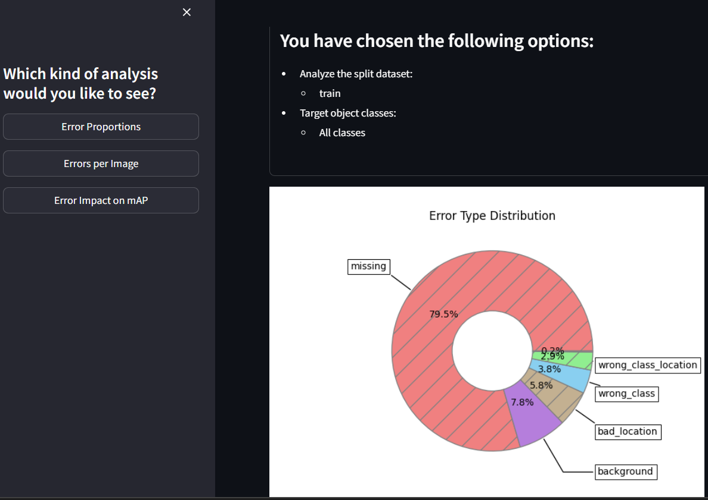
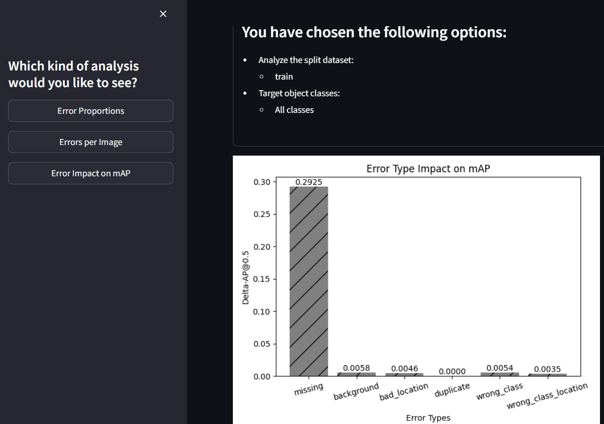
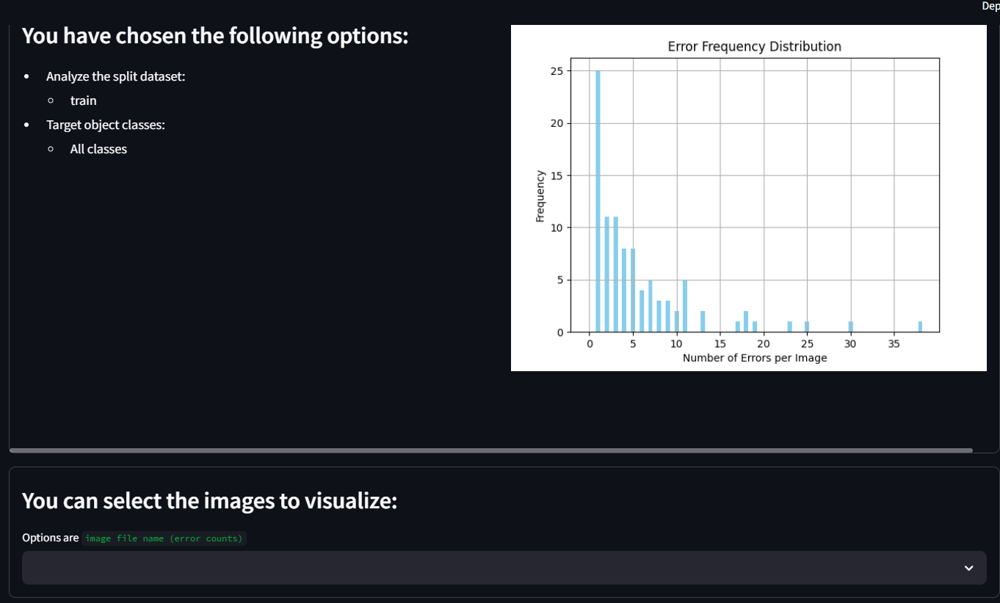
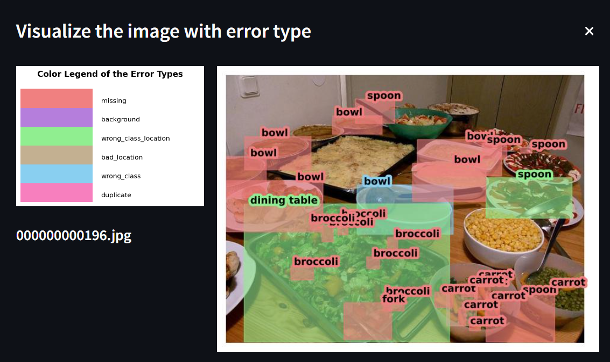

# identify_box_error
Identifying Object Detection Errors for YOLO model

## Motivation
Inspired by the paper,

```
@inproceedings{tide-eccv2020,
  author    = {Daniel Bolya and Sean Foley and James Hays and Judy Hoffman},
  title     = {TIDE: A General Toolbox for Identifying Object Detection Errors},
  booktitle = {ECCV},
  year      = {2020},
}
```
And this reference
https://medium.com/data-science-at-microsoft/error-analysis-for-object-detection-models-338cb6534051

## Features
* Support YOLO txt format
* Support OBB(oriented bounding box) format defined by YOLOv8
* A summary plot for your model’s errors
  * Error Proportion 

    

  * Delta-mAP

    
    
  * Histogram
    
    

  * Error annotation
    
    

## <div align="center">Documentation</div>

<details open>
<summary>Install</summary>

Create your conda environment and install the dependencies.

```
$ conda create --name box_analyze python=3.12
$ conda activate box_analyze
$ pip install poetry
$ cd <this_repo>
$ poetry install
```

</details>

<details open>
<summary>Verify the installation</summary>

Unit test
```
$ python -m pytest test
```
</details>

<details open>
<summary>Usage</summary>

```
python main.py 
--yaml_path <the data.yaml used by yolov8> 
--data_subset <train, val or test> 
--predict_folder_path <the output folder used by yolov8>
--analysis_folder_path <the output folder used by this project>
--is_obb
```
* Ex.
     
    yaml_path = "datasets/cfg/coco128.yaml"

    data_subset = "tarin"

    predict_folder_path = "/run/detect/"

    analysis_folder_path = "predictions/analyzed_train"
    
    is_obb is for telling this project to handle an oriented bounding box dataset

</details>

<details open>
<summary>Limitation</summary>

* Currently, this project reads the cache file generated by yolov8.

  The path of dataset is defined in the yaml file you provide.

</details>
